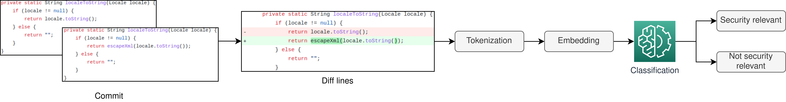

# Explainability Tool #


This repository contains the Explainability Tool developed by Pluribus One in 
the context of the [AssureMOSS](https://assuremoss.eu) project.

Our tool perform the detection of security-relevant GitHub commits (on JAVA code only),
e.g., code changes that are related to a vulnerability fixing,
and shows how individual source code tokens have influenced the decision.
A video demonstration of the tool can be found [here](https://youtu.be/P9xZt4w-lq8).

## Commit Classifier and Explainer



We base our tool on [JavaBERT-uncased](https://huggingface.co/CAUKiel/JavaBERT-uncased)
([link](https://arxiv.org/abs/2110.10404) to the related publication on arxiv)
model, that we fine-tuned on the commit classification task.
Explanations are obtained by applying the 
[Layer Integrated Gradients](https://captum.ai/api/layer.html#layer-integrated-gradients) 
method.

## Launch the tool

The Explainability Tool app is implemented with FastAPI and can be launched in several ways.
For instance, you can use uvicorn:
```shell
uvicorn main:app --host 0.0.0.0 --port 8000
```

Before launching the tool, you can choose whether running the model on CPU or GPU
by changing the `DEVICE` parameter from `main.py`.

The first launch might be slower because the model will be downloaded.

To analyze a commit you must paste a commit url from GitHub.
If the commit belong to a large repository, you might experiment a slight delay
on the first analysis from it, as the entire repository need to be downloaded.

## Interpret the visualizations

In the visualizations, a commit diff is shown as follows: 
changed lines start either with a `+` or a `−` symbol, depending on if they belong
to the new version of the modified methods or the previous one.
If a line is present in both versions, an additional line starting with `?` 
helps to identify added or removed characters (again, with `+` or `−` symbols,
respectively).
On each diff line, tokens that influence the classifier’s decision towards the positive
class (i.e., security-relevant) are highlighted in green, whereas tokens that push toward the other class
are highlighted in red.
Neutral tokens are not highlighted.
The colour intensity is related to the weight that each token assumes in the decision.